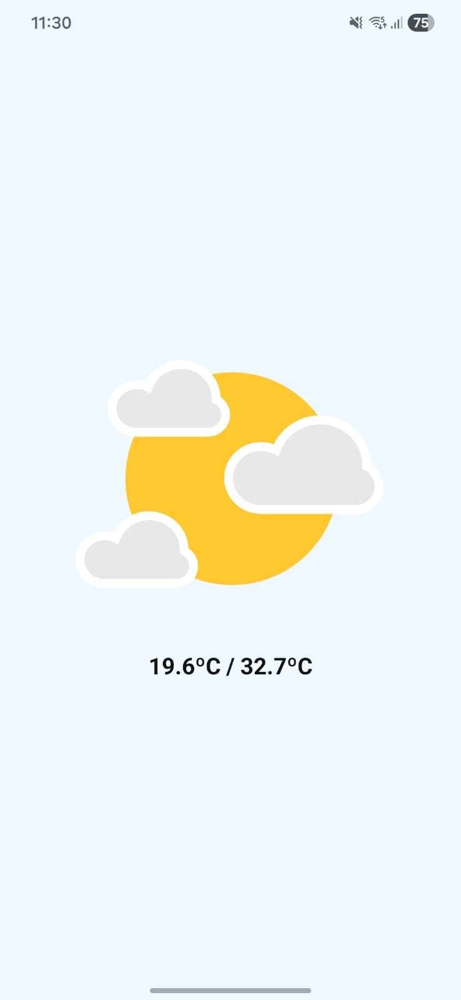
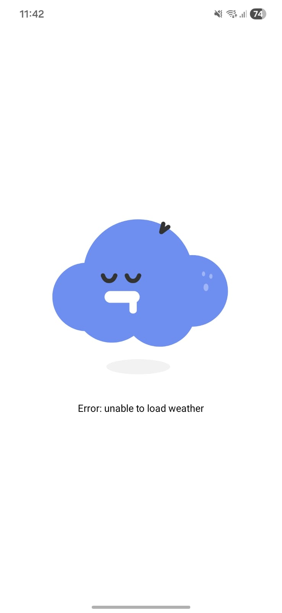

# Weather App - React Native & Expo

A simple weather application built with **React Native** and **Expo** that shows the current weather based on your IP address. The app fetches location and weather data automatically and displays it with **Lottie animations** for a fun visual experience.

## Features

- Detects your IP address and gets your location.
- Fetches current weather using latitude and longitude.
- Shows weather animations using **Lottie**:
  - Sunny
  - Partly Cloudy
  - Rain / Showers
  - Storm
  - Windy
- Displays minimum and maximum temperatures.
- Error handling with fallback animation.
- Loading animation while fetching data.
- Dynamic background for day and night.

## How It Works

1. The app uses **Axios** to request your IP.
2. Fetches your approximate location from your IP.
3. Requests weather data using the obtained latitude and longitude.
4. Displays a **Lottie animation** based on the weather condition code.
5. Shows fallback animations if loading fails or while fetching data.

## Screenshots

<div style="display: flex; flex-direction: row; gap: 15px;">
    
    
</div>

## Installation

```bash
git clone https://github.com/brunols7/weather-app.git
cd weather-app
npm install
expo start
```

## Technologies Used

- React Native
- Expo
- Axios
- Lottie React Native

## Notes

- This project is mainly for learning purposes.
- You can customize Lottie animations for different weather codes in `WeatherScreen.tsx`.